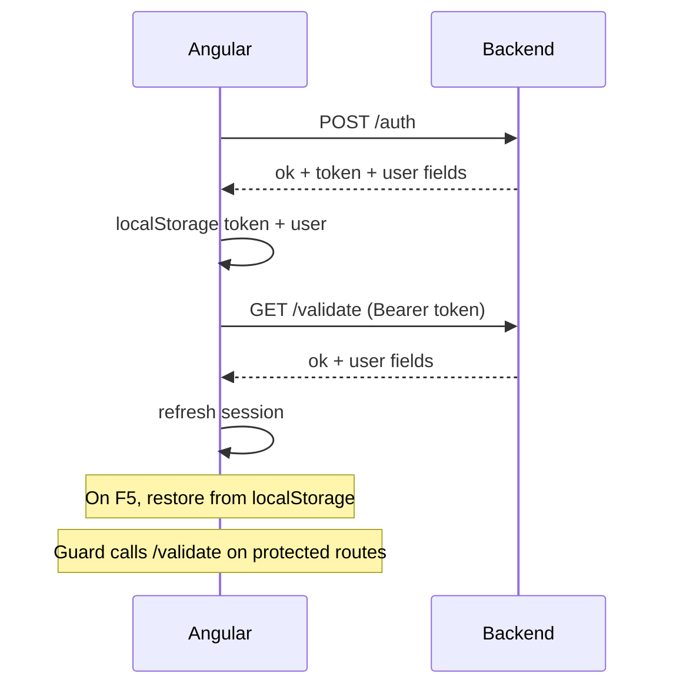

# Authentication API Contract

Contract between **AngularPracticeFronted** and the backend API.

Use this document when implementing the backend in a separate project. The frontend implementation lives in:

- `src/app/pages/auth/services/auth.service.ts`
- `src/app/pages/auth/interfaces/interfaces.ts`
- `src/app/interceptors/auth.interceptor.ts`
- `src/environments/environment.ts`

## Base configuration

| Setting | Value |
|---------|-------|
| Base URL | `http://localhost:5000/api/authentication` |
| Frontend origin (dev) | `http://localhost:4200` |
| Auth header | `Authorization: Bearer <token>` |
| Content-Type | `application/json` |

### CORS

The backend must allow requests from the Angular dev server:

- Origin: `http://localhost:4200`
- Methods: `GET`, `POST`, `OPTIONS`
- Headers: `Content-Type`, `Authorization`

### Enable real API in the frontend

In `src/environments/environment.ts` (or prod):

```typescript
useMockAuth: false
```

While `useMockAuth` is `true`, the frontend does not call these endpoints.

---

## User model (frontend)

Stored in NgRx and `localStorage` as `user`:

```json
{
  "username": "string",
  "email": "string",
  "registerDate": "2020-01-01T12:00:00.000Z"
}
```

- `registerDate` must be an **ISO 8601** string (UTC recommended).
- `token` is stored separately in `localStorage` under `token`.
- Password is **never** returned by the API.

---

## Endpoints

### 1. Login

Authenticates a user and returns a JWT plus profile data.

```
POST /api/authentication/auth
```

#### Request body

```json
{
  "username": "robuser",
  "password": "my-secret-password"
}
```

| Field | Type | Rules |
|-------|------|-------|
| `username` | string | Required. Frontend trims leading/trailing spaces before sending. |
| `password` | string | Required. Sent as-is (no trim). |

#### Success response — `200 OK`

```json
{
  "ok": true,
  "username": "robuser",
  "email": "rob@example.com",
  "registerDate": "2024-06-01T15:30:00.000Z",
  "token": "eyJhbGciOiJIUzI1NiIsInR5cCI6IkpXVCJ9..."
}
```

| Field | Type | Required on success |
|-------|------|---------------------|
| `ok` | boolean | `true` |
| `username` | string | yes |
| `email` | string | yes |
| `registerDate` | string | yes (ISO 8601) |
| `token` | string | yes (JWT) |

#### Error response — `400` / `401`

Frontend reads the message from `error.msg` in the response body:

```json
{
  "ok": false,
  "msg": "Invalid credentials"
}
```

Angular usage:

```typescript
catchError((err) => of(err.error.msg))
```

Recommended HTTP status: `401 Unauthorized` for wrong credentials.

---

### 2. Register

Creates a new user account. Does **not** log the user in automatically; frontend redirects to sign-in after success.

```
POST /api/authentication/register
```

#### Request body

```json
{
  "username": "robuser",
  "email": "rob@example.com",
  "password": "123456"
}
```

| Field | Type | Rules |
|-------|------|-------|
| `username` | string | Required. Frontend trims spaces. Min 6, max 20 (validated in UI). |
| `email` | string | Required. Valid email format. Frontend trims spaces. |
| `password` | string | Required. Min 6, max 40 (validated in UI). No trim. |

#### Success response — `200 OK` or `201 Created`

```json
{
  "ok": true
}
```

#### Error response — `400` / `409`

```json
{
  "ok": false,
  "msg": "That username is already taken"
}
```

Frontend reads `resp.msg` or `err.error.msg`.

Recommended HTTP status: `409 Conflict` for duplicate username/email.

---

### 3. Validate token

Validates the JWT and returns the current user. Called by the route guard when accessing protected routes.

```
GET /api/authentication/validate
```

#### Request headers

```
Authorization: Bearer <token>
```

The frontend adds this header automatically via `AuthInterceptor` for all requests to `baseUrl`.

#### Success response — `200 OK`

Same shape as login success:

```json
{
  "ok": true,
  "username": "robuser",
  "email": "rob@example.com",
  "registerDate": "2024-06-01T15:30:00.000Z",
  "token": "eyJhbGciOiJIUzI1NiIsInR5cCI6IkpXVCJ9..."
}
```

If `ok` is `true`, the frontend refreshes the session (`token` + `user` in storage).

`token` may be the same JWT or a new one (frontend overwrites `localStorage`).

#### Error response — `401 Unauthorized`

Any non-success response causes the frontend to:

1. Call `logout()` (clear session)
2. Deny route access (redirect to `/sign-in`)

Empty body is acceptable; frontend only checks `resp.ok`.

---

## JWT requirements

| Topic | Recommendation |
|-------|----------------|
| Format | JWT (Bearer token) |
| Header | `Authorization: Bearer <token>` |
| Payload | At least `sub` or `username` to identify the user |
| Expiration | Recommended (e.g. 1h–24h); expired tokens → `401` on `/validate` |
| Secret | Store in environment variables, never in the repo |

---

## Error body convention

All error responses should use this shape so the frontend can show messages:

```json
{
  "ok": false,
  "msg": "Human-readable error message"
}
```

Angular expects `err.error.msg` on HTTP errors.

---

## Session flow (frontend)



1. **Login** → `POST /auth` → save `token` + `user`.
2. **Page refresh** → restore from `localStorage` (no API call on startup).
3. **Protected route** → guard calls `GET /validate` with Bearer token.
4. **Invalid token** → logout + redirect to sign-in.
5. **Register** → `POST /register` → user goes to sign-in manually.

---

## Example curl commands

### Login

```bash
curl -X POST http://localhost:5000/api/authentication/auth \
  -H "Content-Type: application/json" \
  -d "{\"username\":\"robuser\",\"password\":\"123456\"}"
```

### Register

```bash
curl -X POST http://localhost:5000/api/authentication/register \
  -H "Content-Type: application/json" \
  -d "{\"username\":\"robuser\",\"email\":\"rob@example.com\",\"password\":\"123456\"}"
```

### Validate

```bash
curl http://localhost:5000/api/authentication/validate \
  -H "Authorization: Bearer YOUR_JWT_HERE"
```

---

## Backend checklist

- [ ] Listen on port `5000` (or update `environment.baseUrl` in the frontend)
- [ ] Enable CORS for `http://localhost:4200`
- [ ] `POST /api/authentication/auth`
- [ ] `POST /api/authentication/register`
- [ ] `GET /api/authentication/validate` with JWT middleware
- [ ] Hash passwords (bcrypt, argon2, etc.) — never store plain text
- [ ] Return `{ ok, msg }` on errors
- [ ] Return `username`, `email`, `registerDate`, `token` on auth success
- [ ] Set `useMockAuth: false` in the frontend to test integration

---

## Version

- Contract version: **1.0**
- Frontend repo: AngularPracticeFronted
- Last updated: 2026-06-04
